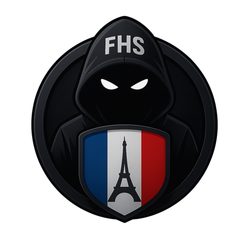

<div align="center">
  <div style="width: 200px; height: 200px; border-radius: 50%; border: 5px solid #0055A4; box-shadow: 0 0 40px rgba(0,85,164,0.8); margin: 30px 0; overflow: hidden; display: flex; align-items: center; justify-content: center; background: #000;">
    
  </div>
  
  # French Hackers Squad (FHS)
  
  <p align="center">
    <strong>Collectif d'élite en lutte contre la pédopornographie</strong>
  </p>

  <p align="center">
    <a href="https://reactjs.org">
      
    </a>
    <a href="https://www.typescriptlang.org">
      
    </a>
    <a href="https://vitejs.dev">
      
    </a>
    <a href="https://supabase.com">
      
    </a>
  </p>

  <p align="center">
    
    
    
  </p>

  <p align="center">
    <a href="#-notre-mission">Mission</a> •
    <a href="#-notre-approche">Approche</a> •
    <a href="#-fonctionnalités">Fonctionnalités</a> •
    <a href="#-installation">Installation</a> •
    <a href="#-contact--collaboration">Contact</a>
  </p>
</div>

---

## 🎯 Notre Mission

<div align="center">
  <h3>« Protéger les enfants dans le cyberespace »</h3>
</div>

<div align="center">
  
  
  
</div>

<br/>

French Hackers Squad (FHS) est un collectif d'élite spécialisé dans la traque et la neutralisation des sites de pédopornographie. Nous opérons dans le strict respect du cadre légal, en collaboration étroite avec les forces de l'ordre et les autorités compétentes.

## 🛡️ Notre Approche

<table align="center">
  <tr>
    <td align="center" width="33%">
      
      <br />
      <b>Surveillance active</b>
      <br />
      Monitoring 24/7 des réseaux
    </td>
    <td align="center" width="33%">
      
      <br />
      <b>Neutralisation</b>
      <br />
      Action rapide et efficace
    </td>
    <td align="center" width="33%">
      
      <br />
      <b>Coordination</b>
      <br />
      Réseau international
    </td>
  </tr>
</table>

## 💻 Fonctionnalités

<div align="center">
  <table>
    <tr>
      <td align="center" width="25%">
        <h3>🖥️ Monitoring</h3>
        <p>Surveillance temps réel<br/>Analyse automatique<br/>Alertes instantanées</p>
      </td>
      <td align="center" width="25%">
        <h3>⌨️ Terminal</h3>
        <p>Interface CLI avancée<br/>Commandes puissantes<br/>Contrôle total</p>
      </td>
      <td align="center" width="25%">
        <h3>📊 Dashboard</h3>
        <p>Statistiques détaillées<br/>Suivi en direct<br/>Rapports complets</p>
      </td>
      <td align="center" width="25%">
        <h3>🚨 Signalements</h3>
        <p>Gestion centralisée<br/>Suivi des actions<br/>Base de données</p>
      </td>
    </tr>
  </table>
</div>

## 🛠️ Stack Technique

<div align="center">
  <table>
    <tr>
      <th>
        
      </th>
      <th>
        
      </th>
      <th>
        
      </th>
      <th>
        
      </th>
    </tr>
    <tr>
      <td>
        • React 18<br/>
        • TypeScript<br/>
        • Vite
      </td>
      <td>
        • Tailwind CSS<br/>
        • Shadcn/ui<br/>
        • Lucide Icons
      </td>
      <td>
        • Supabase<br/>
        • Authentication<br/>
        • Real-time DB
      </td>
      <td>
        • pnpm<br/>
        • ESLint<br/>
        • Git
      </td>
    </tr>
  </table>
</div>

## 🚀 Installation

<div align="center">

  

</div>

```bash
# 1. Cloner le repository
git clone https://github.com/french-hackers-squad/fhs-platform.git
cd fhs-platform

# 2. Installer les dépendances
pnpm install

# 3. Configuration
# Renommer .env.example en .env et configurer la base de données

# 4. Lancer en développement
pnpm dev

# 5. Build production
pnpm build
pnpm preview
```

## 🔒 Sécurité

<div align="center">
  <table>
    <tr>
      <td align="center">
        
      </td>
      <td align="center">
        
      </td>
      <td align="center">
        
      </td>
      <td align="center">
        
      </td>
    </tr>
  </table>
</div>

## 📞 Contact & Collaboration

<div align="center">
  <table>
    <tr>
      <td align="center">
        
        <br/>
        <b>discord.gg/fhs</b>
      </td>
      <td align="center">
        
        <br/>
        <b>contact@fhs.fr</b>
      </td>
      <td align="center">
        
        <br/>
        <b>careers@fhs.fr</b>
      </td>
    </tr>
  </table>
</div>

## 👩‍💻 Développement

<div align="center">
  
  <br/>
  
</div>

---

<div align="center">
  <p>
    
  </p>
  <p>
    
  </p>
</div>
